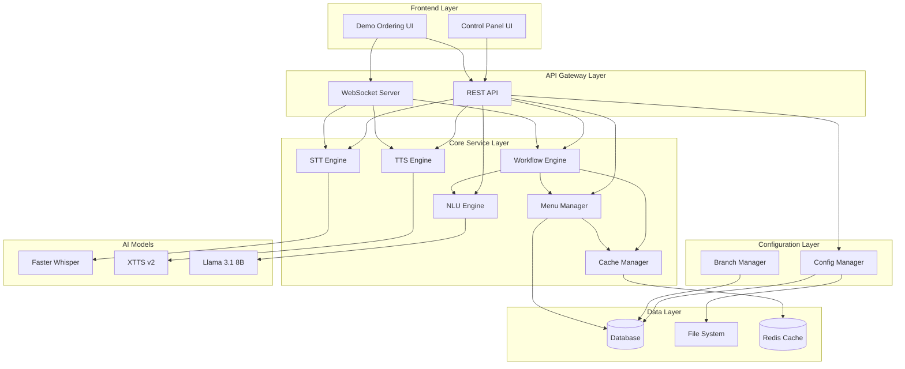
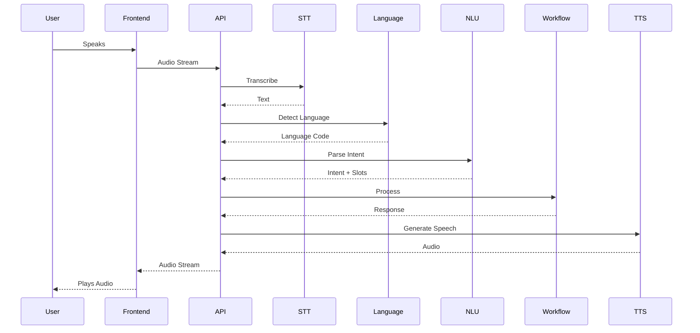
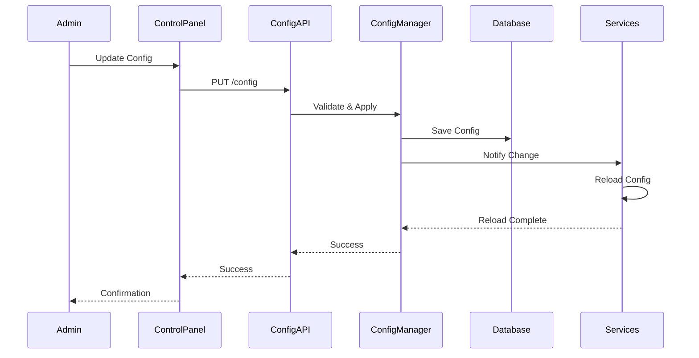

# Architecture Overview

## Document Information

- **Document Version**: 1.0
- **Date**: [Current Date]
- **Status**: Approved
- **Author**: Technical Documentation Team

## 1. Introduction

This document provides a comprehensive overview of the AI Drive-Thru Demo Application architecture, including system design, component interactions, data flow, technology stack, and deployment architecture.

## 2. System Architecture

### 2.1 High-Level Architecture



### 2.2 Component Layers

1. **Frontend Layer**: User interfaces (Control Panel, Demo UI)
2. **API Gateway Layer**: REST API and WebSocket server
3. **Core Service Layer**: Business logic and AI services
4. **Configuration Layer**: Dynamic configuration management
5. **Data Layer**: Data persistence and caching
6. **AI Models Layer**: ML models (STT, TTS, LLM)

## 3. Component Interactions

### 3.1 Voice Interaction Flow

```
User → Microphone → WebSocket → STT Engine → Language Detector
  → NLU Engine → Workflow Engine → TTS Engine → Speaker → User
```

### 3.2 Configuration Update Flow

```
Admin → Control Panel → REST API → Config Manager → Validation
  → Database → Cache Invalidation → Service Notification → Hot Reload
```

### 3.3 Order Processing Flow

```
User Speech → STT → Language Detection → NLU → Intent Classification
  → Slot Extraction → Workflow Engine → Menu Manager → Order Creation
  → Confirmation → TTS → User
```

## 4. Data Flow

### 4.1 Request Flow



### 4.2 Configuration Flow



## 5. Technology Stack

### 5.1 Backend

- **Language**: Python 3.10+
- **Framework**: FastAPI (recommended)
- **WebSocket**: WebSocket support for real-time communication
- **Database**: PostgreSQL or MySQL
- **Cache**: Redis
- **ORM**: SQLAlchemy

### 5.2 Frontend

- **Framework**: React or Next.js (recommended)
- **Language**: TypeScript
- **State Management**: Redux or Zustand
- **UI Library**: Material-UI or Tailwind CSS
- **WebSocket Client**: Native WebSocket or Socket.io client

### 5.3 AI Models

- **STT**: Faster Whisper
- **TTS**: Coqui XTTS v2
- **LLM/NLU**: Llama 3.1 8B (quantized)

### 5.4 Infrastructure

- **Platform**: Mac Studio (local development)
- **GPU**: Metal acceleration
- **Containerization**: Docker (optional)
- **Process Management**: Systemd or PM2

## 6. System Components

### 6.1 STT Engine

**Purpose**: Convert speech to text
**Technology**: Faster Whisper
**Input**: Audio stream
**Output**: Transcribed text, confidence, language
**Performance**: < 500ms latency

### 6.2 TTS Engine

**Purpose**: Convert text to speech
**Technology**: Coqui XTTS v2
**Input**: Text, language, voice config
**Output**: Audio stream
**Performance**: < 1s latency

### 6.3 NLU Engine

**Purpose**: Understand user intent and extract information
**Technology**: Llama 3.1 8B
**Input**: Text, context
**Output**: Intent, slots, entities
**Performance**: < 200ms latency

### 6.4 Workflow Engine

**Purpose**: Manage conversation flow and order state
**Technology**: Custom Python implementation
**Input**: Intent, slots, context
**Output**: Response, next state
**Features**: State management, branching logic

### 6.5 Menu Manager

**Purpose**: Manage menu data and structure
**Technology**: Database + Cache
**Input**: Menu operations
**Output**: Menu data
**Features**: CRUD operations, validation, caching

### 6.6 Configuration Manager

**Purpose**: Manage dynamic system configuration
**Technology**: Database + File System
**Input**: Configuration updates
**Output**: Applied configuration
**Features**: Hot reload, validation, versioning

### 6.7 Cache Manager

**Purpose**: Cache frequently accessed data
**Technology**: Redis
**Input**: Cache operations
**Output**: Cached data
**Features**: TTL, invalidation, multiple cache types

## 7. Data Architecture

### 7.1 Database Schema (High-Level)

```
Branches
  - id, name, settings, menu_id

Menus
  - id, branch_id, version, categories

Categories
  - id, menu_id, name_ar, name_en, display_order

Items
  - id, category_id, name_ar, name_en, price, available

Variants
  - id, item_id, name_ar, name_en, price_modifier

AddOns
  - id, item_id, name_ar, name_en, price, conditional

Keywords
  - id, item_id, keywords_ar, keywords_en

Configurations
  - id, branch_id, section, config_data, version

Orders
  - id, branch_id, items, total, status, created_at

Logs
  - id, level, component, message, timestamp
```

### 7.2 Cache Structure

- **TTS Cache**: `tts:{text_hash}:{language}:{voice}`
- **Menu Cache**: `menu:{menu_id}:{version}`
- **NLU Cache**: `nlu:{text_hash}:{context_hash}`
- **Config Cache**: `config:{branch_id}:{section}`

## 8. Deployment Architecture

### 8.1 Local Development (Mac Studio)

```
┌─────────────────────────────────────┐
│         Mac Studio                  │
│                                     │
│  ┌──────────┐    ┌──────────┐     │
│  │ Frontend │    │ Backend  │     │
│  │ (React)  │◄───┤ (FastAPI)│     │
│  └──────────┘    └────┬─────┘     │
│                       │            │
│  ┌──────────┐    ┌────▼─────┐     │
│  │ Database │    │  Redis   │     │
│  │(Postgres)│    │  Cache   │     │
│  └──────────┘    └──────────┘     │
│                                     │
│  ┌──────────────────────────────┐ │
│  │      AI Models (Local)        │ │
│  │  STT | TTS | LLM              │ │
│  └──────────────────────────────┘ │
└─────────────────────────────────────┘
```

### 8.2 Production Architecture (Future)

```
┌─────────────┐    ┌─────────────┐
│   Load      │    │   API       │
│   Balancer  │───►│   Gateway   │
└─────────────┘    └──────┬──────┘
                          │
        ┌─────────────────┼─────────────────┐
        │                 │                 │
   ┌────▼────┐      ┌────▼────┐      ┌────▼────┐
   │ Backend │      │ Backend │      │ Backend │
   │  App 1  │      │  App 2  │      │  App N  │
   └────┬────┘      └────┬────┘      └────┬────┘
        │                 │                 │
   ┌────▼─────────────────▼─────────────────▼────┐
   │         Shared Services                      │
   │  Database | Cache | Message Queue           │
   └──────────────────────────────────────────────┘
```

## 9. Security Architecture

### 9.1 Authentication & Authorization

- **Control Panel**: User authentication required
- **API**: Token-based authentication
- **Role-Based Access**: Admin, Operator, Viewer roles

### 9.2 Data Security

- **Encryption**: Encrypt sensitive configuration data
- **Input Validation**: Validate all inputs
- **SQL Injection Prevention**: Parameterized queries
- **XSS Prevention**: Escape output

### 9.3 Network Security

- **HTTPS**: Use HTTPS for all communications
- **WebSocket Security**: Secure WebSocket (WSS)
- **CORS**: Configure CORS appropriately

## 10. Scalability Considerations

### 10.1 Horizontal Scaling

- **Stateless Services**: Backend services are stateless
- **Load Balancing**: Multiple backend instances
- **Database Scaling**: Read replicas for database
- **Cache Clustering**: Redis cluster for cache

### 10.2 Vertical Scaling

- **Model Optimization**: Use quantized models
- **Caching**: Aggressive caching strategy
- **Resource Management**: Monitor and optimize resource usage

### 10.3 Performance Optimization

- **Model Preloading**: Preload models at startup
- **Pipeline Optimization**: Optimize AI pipelines
- **Database Optimization**: Index optimization, query optimization
- **Caching Strategy**: Cache frequently accessed data

## 11. Monitoring & Logging

### 11.1 Monitoring

- **Health Checks**: Component health monitoring
- **Performance Metrics**: Latency, throughput, accuracy
- **Resource Usage**: CPU, memory, GPU usage
- **Error Rates**: Track error rates and types

### 11.2 Logging

- **Structured Logging**: JSON format logs
- **Log Levels**: DEBUG, INFO, WARN, ERROR
- **Log Aggregation**: Centralized log collection
- **Log Retention**: Configurable retention period

### 11.3 Alerting

- **Health Alerts**: Alert on component failures
- **Performance Alerts**: Alert on performance degradation
- **Error Alerts**: Alert on high error rates

## 12. Error Handling

### 12.1 Error Types

1. **Model Errors**: STT/TTS/LLM failures
2. **Service Errors**: Service unavailability
3. **Data Errors**: Invalid data, validation failures
4. **Network Errors**: Connection failures

### 12.2 Error Handling Strategy

- **Graceful Degradation**: Fallback mechanisms
- **Error Recovery**: Automatic retry with backoff
- **User Feedback**: Clear error messages
- **Logging**: Log all errors for debugging

## 13. Integration Points

### 13.1 Internal Integrations

- Voice Interaction ↔ Language Detection
- Language Detection ↔ NLU
- NLU ↔ Workflow Engine
- Workflow Engine ↔ Menu Manager
- Control Panel ↔ Configuration Manager

### 13.2 External Integration Points (Future)

- Payment Gateway (out of scope)
- POS System (out of scope)
- Kitchen Display (out of scope)
- Delivery Platforms (out of scope)

## 14. Development Workflow

### 14.1 Code Organization

```
project/
├── src/
│   ├── services/      # Core services (STT, TTS, NLU)
│   ├── api/           # API endpoints
│   ├── models/        # Data models
│   ├── config/        # Configuration
│   ├── utils/         # Utilities
│   └── tests/         # Tests
├── frontend/
│   ├── components/    # UI components
│   ├── pages/         # Pages
│   ├── services/     # API clients
│   └── utils/         # Utilities
├── docs/              # Documentation
└── scripts/           # Deployment scripts
```

### 14.2 Development Process

1. **Design**: Review architecture and design
2. **Implement**: Write code following standards
3. **Test**: Write and run tests
4. **Review**: Code review
5. **Deploy**: Deploy to environment
6. **Monitor**: Monitor performance and errors

## 15. Future Enhancements

### 15.1 Scalability

- Cloud deployment
- Multi-region support
- Auto-scaling

### 15.2 Features

- Advanced analytics
- Machine learning improvements
- Integration with external systems
- Mobile app support

### 15.3 Performance

- Model optimization
- Caching improvements
- Database optimization
- Network optimization

---

**Document Status**: Complete
**Next Steps**: Begin implementation following this architecture
