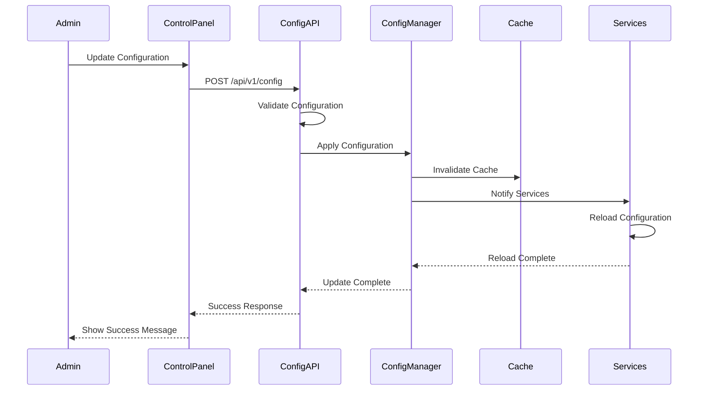
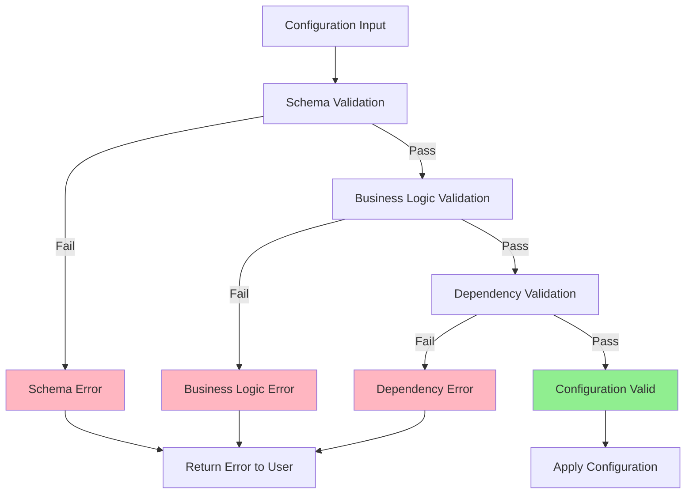
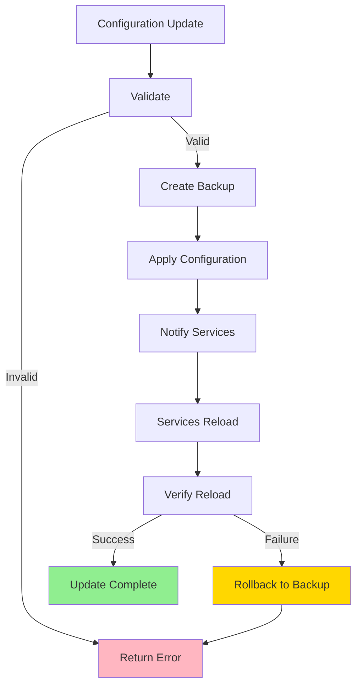

# Dynamic Configuration System Specification

## Document Information

- **Document Version**: 1.0
- **Date**: [Current Date]
- **Status**: Approved
- **Author**: Technical Documentation Team

## 1. Introduction

The Dynamic Configuration System enables real-time configuration updates without code changes. All system settings, menu data, workflow rules, and model selections can be modified through the Control Panel and take effect immediately.

## 2. Architecture Overview

### 2.1 Configuration Layers

```
┌─────────────────────────────────────────────────────────┐
│              Control Panel UI Layer                      │
│         (Configuration Interface)                         │
└────────────────────┬────────────────────────────────────┘
                     │
┌────────────────────▼────────────────────────────────────┐
│            Configuration API Layer                        │
│      (Validation, Transformation, Persistence)            │
└────────────────────┬────────────────────────────────────┘
                     │
┌────────────────────▼────────────────────────────────────┐
│         Configuration Manager Layer                      │
│    (Hot Reload, Branch Routing, Cache Management)        │
└────────────────────┬────────────────────────────────────┘
                     │
┌────────────────────▼────────────────────────────────────┐
│          Configuration Storage Layer                     │
│         (Database, File System, Cache)                   │
└─────────────────────────────────────────────────────────┘
```

### 2.2 Configuration Types

1. **System Configuration**: Global system settings
2. **Branch Configuration**: Branch-specific overrides
3. **Menu Configuration**: Dynamic menu data
4. **Model Configuration**: STT/TTS/LLM model settings
5. **Workflow Configuration**: Conversation flow rules
6. **NLU Configuration**: Keywords, patterns, intents
7. **Voice Configuration**: TTS personality, STT settings

## 3. Configuration Structure

### 3.1 System Configuration Schema

```json
{
  "system": {
    "version": "1.0.0",
    "branch_id": "branch-001",
    "language": {
      "default": "ar",
      "detection": {
        "method": "hybrid",
        "confidence_threshold": 0.7,
        "code_switch_threshold": 0.3,
        "min_words_for_switch": 4
      },
      "fallback": {
        "enabled": true,
        "fallback_language": "ar",
        "prompt_on_uncertain": true
      }
    },
    "voice": {
      "timeout": 5000,
      "sensitivity": 0.7,
      "interruption": {
        "enabled": true,
        "detection_threshold": 0.7,
        "response_delay": 200
      }
    },
    "performance": {
      "max_concurrent_users": 10,
      "gpu_enabled": true,
      "batch_size": 4,
      "cache_ttl": 3600
    }
  }
}
```

### 3.2 Branch Configuration Schema

```json
{
  "branch": {
    "id": "branch-001",
    "name": "Demo Branch",
    "menu_id": "menu-001",
    "settings": {
      "language_default": "ar",
      "currency": "SAR",
      "tax_rate": 0.15,
      "welcome_message": {
        "ar": "مرحباً، كيف يمكنني مساعدتك؟",
        "en": "Welcome, how can I help you?"
      }
    },
    "overrides": {
      "voice_timeout": 6000,
      "tts_speed": 1.1
    }
  }
}
```

### 3.3 Menu Configuration Schema

```json
{
  "menu": {
    "id": "menu-001",
    "branch_id": "branch-001",
    "version": "1.2.3",
    "last_updated": "2024-01-15T10:30:00Z",
    "categories": [
      {
        "id": "cat-001",
        "name_ar": "المشروبات",
        "name_en": "Beverages",
        "display_order": 1,
        "items": [
          {
            "id": "item-001",
            "name_ar": "قهوة",
            "name_en": "Coffee",
            "description_ar": "قهوة عربية أصيلة",
            "description_en": "Authentic Arabic coffee",
            "base_price": 5.00,
            "available": true,
            "variants": [
              {
                "id": "var-001",
                "name_ar": "صغير",
                "name_en": "Small",
                "price_modifier": 0.00
              },
              {
                "id": "var-002",
                "name_ar": "كبير",
                "name_en": "Large",
                "price_modifier": 2.00
              }
            ],
            "add_ons": [
              {
                "id": "addon-001",
                "name_ar": "حليب",
                "name_en": "Milk",
                "price": 1.00,
                "conditional": {
                  "type": "always",
                  "conditions": []
                }
              }
            ],
            "keywords": {
              "ar": ["قهوة", "كوفي", "coffee"],
              "en": ["coffee", "cafe", "java"]
            }
          }
        ]
      }
    ]
  }
}
```

### 3.4 Model Configuration Schema

```json
{
  "models": {
    "stt": {
      "model": "faster-whisper-base",
      "device": "cuda",
      "language": "auto",
      "vad_threshold": 0.5,
      "chunk_length": 30,
      "beam_size": 5,
      "temperature": 0.0
    },
    "tts": {
      "model": "xtts-v2",
      "voice": "default",
      "speed": 1.0,
      "tone": "warm",
      "gender": "neutral",
      "language": "auto",
      "sample_rate": 22050
    },
    "llm": {
      "model": "llama-3.1-8b",
      "device": "cuda",
      "temperature": 0.7,
      "max_tokens": 512,
      "top_p": 0.9
    }
  }
}
```

### 3.5 Workflow Configuration Schema

```json
{
  "workflow": {
    "version": "1.0.0",
    "nodes": [
      {
        "id": "start",
        "type": "start",
        "next": "welcome"
      },
      {
        "id": "welcome",
        "type": "speak",
        "message": {
          "ar": "مرحباً",
          "en": "Welcome"
        },
        "next": "listen"
      },
      {
        "id": "listen",
        "type": "listen",
        "timeout": 5000,
        "next": "process"
      },
      {
        "id": "process",
        "type": "process",
        "next": "respond"
      }
    ],
    "rules": [
      {
        "condition": "intent == 'order'",
        "action": "add_to_order",
        "next": "confirm"
      }
    ]
  }
}
```

### 3.6 NLU Configuration Schema

```json
{
  "nlu": {
    "intent_threshold": 0.7,
    "slot_threshold": 0.6,
    "keyword_matching": {
      "enabled": true,
      "fuzzy_match": true,
      "accent_safe": true,
      "similarity_threshold": 0.8
    },
    "intents": [
      {
        "id": "order_item",
        "name": "Order Item",
        "patterns": [
          "I want {item}",
          "أريد {item}"
        ],
        "slots": ["item", "size", "quantity"]
      }
    ],
    "trigger_words": {
      "cancel": ["cancel", "إلغاء", "الغي"],
      "repeat": ["repeat", "كرر", "أعد"],
      "modify": ["modify", "عدل", "غير"],
      "remove": ["remove", "احذف", "شيل"]
    }
  }
}
```

## 4. Real-Time Update Mechanism

### 4.1 Update Flow



### 4.2 Hot Reload Process

1. **Validation**: Validate configuration before applying
2. **Backup**: Create backup of current configuration
3. **Apply**: Apply new configuration
4. **Notify**: Notify all services of configuration change
5. **Reload**: Services reload configuration
6. **Verify**: Verify configuration is applied correctly
7. **Rollback**: Rollback to backup if verification fails

### 4.3 Update Propagation

- **Immediate**: Critical settings (model selection, timeouts)
- **Gradual**: Non-critical settings (menu items, keywords)
- **Scheduled**: Bulk updates (menu restructure)

## 5. Configuration Validation

### 5.1 Validation Rules

#### 5.1.1 Schema Validation
- JSON schema validation
- Required field checks
- Type validation
- Range validation

#### 5.1.2 Business Logic Validation
- Menu item price validation
- Workflow rule validation
- Model compatibility checks
- Branch configuration consistency

#### 5.1.3 Dependency Validation
- Model availability
- Menu item dependencies
- Workflow node connections
- Branch menu assignment

### 5.2 Validation Process



## 6. Branch-Linked Configuration

### 6.1 Configuration Hierarchy

```
Global Configuration (Default)
    ↓
Branch Configuration (Override)
    ↓
Session Configuration (Runtime)
```

### 6.2 Branch Configuration Resolution

1. Load global configuration
2. Load branch-specific overrides
3. Merge configurations (branch overrides global)
4. Apply session-specific settings
5. Return resolved configuration

### 6.3 Configuration Inheritance

- **Inherit**: Branch inherits from global
- **Override**: Branch overrides global settings
- **Extend**: Branch extends global settings
- **Isolate**: Branch has independent configuration

## 7. Configuration Persistence

### 7.1 Storage Backend

- **Primary**: Database (PostgreSQL/MySQL)
- **Cache**: Redis for fast access
- **Backup**: File system backup
- **Versioning**: Configuration version history

### 7.2 Persistence Strategy

```json
{
  "storage": {
    "primary": "database",
    "cache": "redis",
    "backup": "filesystem",
    "versioning": true,
    "retention_days": 30
  }
}
```

### 7.3 Configuration Versioning

- **Version Number**: Semantic versioning (1.0.0)
- **Change History**: Track all configuration changes
- **Rollback**: Rollback to previous versions
- **Diff**: Show differences between versions

## 8. API Endpoints

### 8.1 Configuration Management

**GET /api/v1/config**
- Get current configuration
- Query params: `branch_id`, `section`
- Response: Configuration object

**PUT /api/v1/config**
- Update configuration
- Request: Configuration object
- Response: Updated configuration

**POST /api/v1/config/validate**
- Validate configuration
- Request: Configuration object
- Response: Validation result

**POST /api/v1/config/reload**
- Reload configuration
- Request: `{ "section": string }`
- Response: Reload status

**GET /api/v1/config/history**
- Get configuration history
- Query params: `branch_id`, `limit`
- Response: Configuration history

**POST /api/v1/config/rollback**
- Rollback to previous version
- Request: `{ "version": string }`
- Response: Rollback status

### 8.2 Branch Configuration

**GET /api/v1/branches/{branch_id}/config**
- Get branch configuration
- Response: Branch configuration

**PUT /api/v1/branches/{branch_id}/config**
- Update branch configuration
- Request: Branch configuration
- Response: Updated configuration

### 8.3 Menu Configuration

**GET /api/v1/menu**
- Get menu configuration
- Query params: `branch_id`
- Response: Menu configuration

**PUT /api/v1/menu**
- Update menu configuration
- Request: Menu configuration
- Response: Updated menu

**POST /api/v1/menu/publish**
- Publish menu changes
- Request: `{ "menu_id": string }`
- Response: Publish status

### 8.4 Model Configuration

**GET /api/v1/config/models**
- Get model configuration
- Response: Model configuration

**PUT /api/v1/config/models**
- Update model configuration
- Request: Model configuration
- Response: Updated configuration

### 8.5 Workflow Configuration

**GET /api/v1/workflow**
- Get workflow configuration
- Query params: `branch_id`
- Response: Workflow configuration

**PUT /api/v1/workflow**
- Update workflow configuration
- Request: Workflow configuration
- Response: Updated workflow

## 9. Hot-Reload Capabilities

### 9.1 Hot-Reload Scenarios

1. **Menu Updates**: Immediate menu changes
2. **Model Switching**: Switch STT/TTS/LLM models
3. **Workflow Changes**: Update conversation flow
4. **Keyword Updates**: Update NLU keywords
5. **Settings Changes**: Update system settings

### 9.2 Hot-Reload Process



### 9.3 Service Notification

- **WebSocket**: Real-time notifications
- **Event Bus**: Pub/sub for service updates
- **HTTP Polling**: Fallback for services without WebSocket

## 10. Cache Management

### 10.1 Cache Strategy

- **Configuration Cache**: Cache resolved configurations
- **Menu Cache**: Cache menu data
- **Model Cache**: Cache model outputs
- **NLU Cache**: Cache NLU parse results

### 10.2 Cache Invalidation

- **On Update**: Invalidate on configuration update
- **TTL**: Time-based expiration
- **Manual**: Manual cache clearing
- **Selective**: Invalidate specific cache entries

### 10.3 Cache Structure

```json
{
  "cache": {
    "config": {
      "key": "config:branch:{branch_id}",
      "ttl": 3600
    },
    "menu": {
      "key": "menu:{menu_id}",
      "ttl": 1800
    },
    "nlu": {
      "key": "nlu:parse:{text_hash}",
      "ttl": 7200
    }
  }
}
```

## 11. Security Considerations

### 11.1 Access Control

- **Authentication**: User authentication required
- **Authorization**: Role-based access control
- **Audit Log**: Log all configuration changes
- **Encryption**: Encrypt sensitive configuration data

### 11.2 Validation Security

- **Input Sanitization**: Sanitize all inputs
- **SQL Injection Prevention**: Parameterized queries
- **XSS Prevention**: Escape output
- **Rate Limiting**: Limit configuration update rate

## 12. Error Handling

### 12.1 Error Types

1. **Validation Errors**: Invalid configuration
2. **Dependency Errors**: Missing dependencies
3. **Application Errors**: Service reload failures
4. **Storage Errors**: Persistence failures

### 12.2 Error Recovery

- **Automatic Rollback**: Rollback on failure
- **Error Notification**: Notify administrators
- **Retry Logic**: Retry failed operations
- **Fallback Configuration**: Use fallback on critical failures

## 13. Performance Considerations

### 13.1 Optimization Strategies

- **Caching**: Cache resolved configurations
- **Lazy Loading**: Load configurations on demand
- **Batch Updates**: Batch multiple updates
- **Incremental Updates**: Update only changed sections

### 13.2 Performance Targets

- **Configuration Load**: < 100ms
- **Configuration Update**: < 500ms
- **Hot Reload**: < 2s
- **Cache Hit Rate**: > 90%

## 14. Monitoring and Logging

### 14.1 Configuration Monitoring

- **Update Frequency**: Track configuration update rate
- **Reload Success Rate**: Monitor reload success
- **Cache Hit Rate**: Monitor cache performance
- **Error Rate**: Track configuration errors

### 14.2 Logging

- **Configuration Changes**: Log all changes
- **Reload Events**: Log service reloads
- **Errors**: Log all errors with context
- **Performance**: Log performance metrics

---

**Document Status**: Complete
**Next Steps**: Proceed to Model Recommendations
