# Workflow Diagrams & Voice Interaction Lifecycle

## Document Information

- **Document Version**: 1.0
- **Date**: [Current Date]
- **Status**: Approved
- **Author**: Technical Documentation Team

## 1. Introduction

This document provides comprehensive workflow diagrams for the AI Drive-Thru Demo Application. All diagrams use Mermaid syntax for easy rendering in Markdown viewers and documentation systems.

## 2. App Boot Sequence

### 2.1 System Initialization Flow

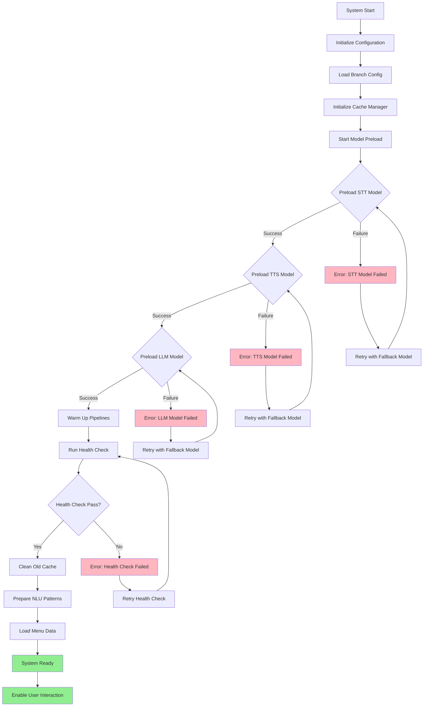

### 2.2 Model Preload Sequence

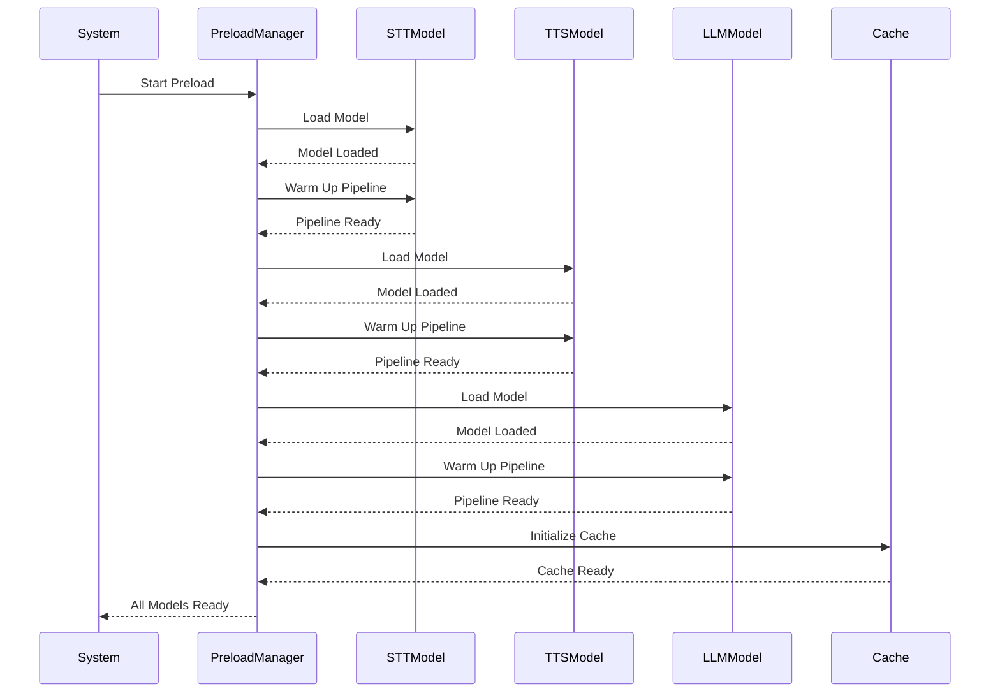

## 3. User Interaction Flow

### 3.1 Complete User Interaction Cycle

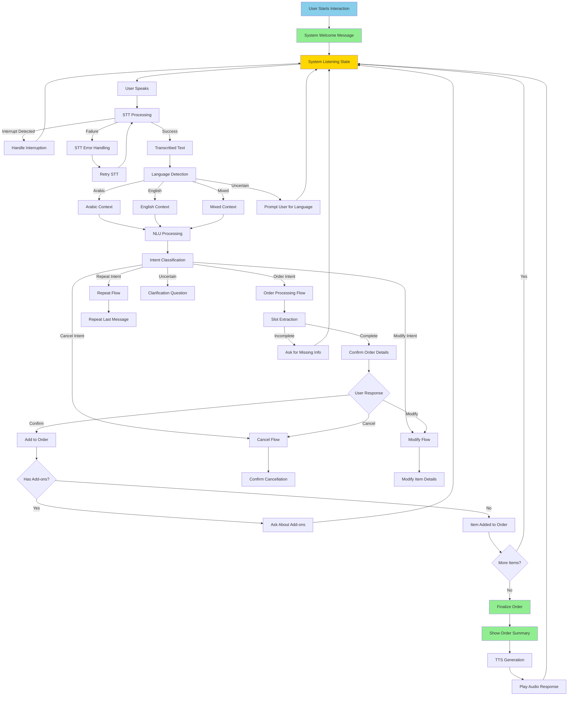

### 3.2 STT → NLU → LLM → Response Flow

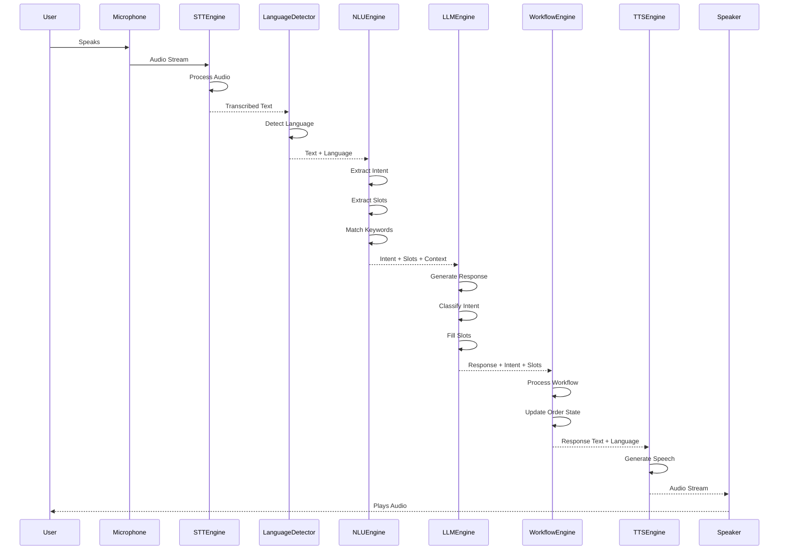

## 4. Interrupt Handling Flow

### 4.1 Voice Interruption Detection and Handling

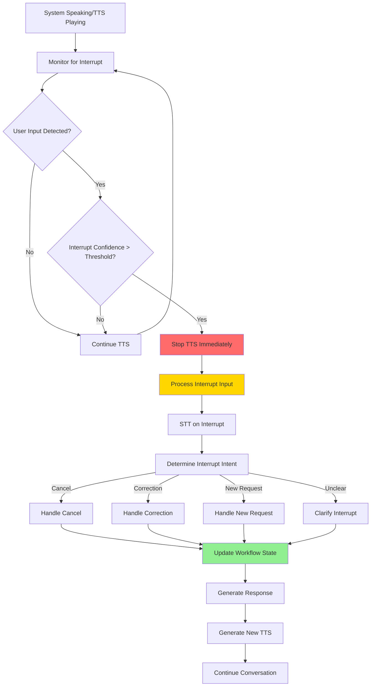

### 4.2 Interrupt State Machine

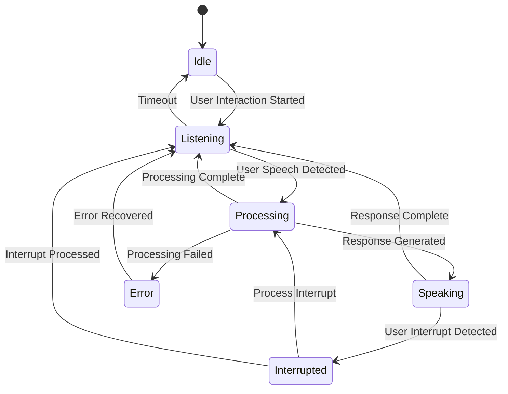

## 5. Error Fallback Workflow

### 5.1 Error Handling and Recovery Flow

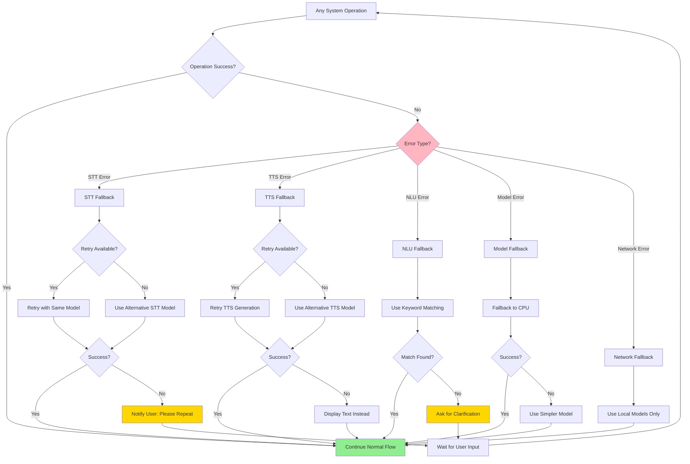

## 6. Menu & Add-on Logic Flow

### 6.1 Menu Item Selection and Add-on Flow

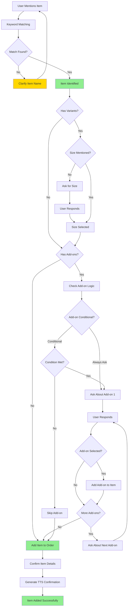

### 6.2 Add-on Branching Logic

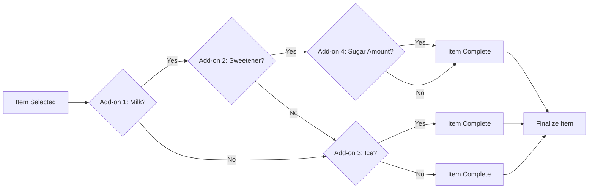

## 7. Branch Dynamic Routing

### 7.1 Branch Configuration and Routing

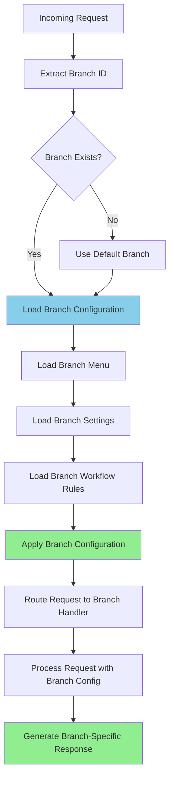

### 7.2 Multi-Branch Architecture

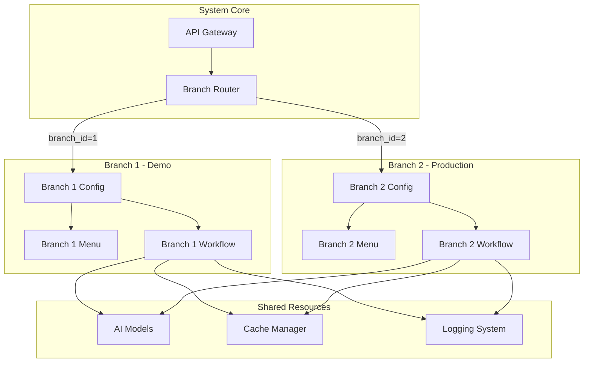

## 8. Voice Interaction Lifecycle State Machine

### 8.1 Complete Voice Interaction State Machine

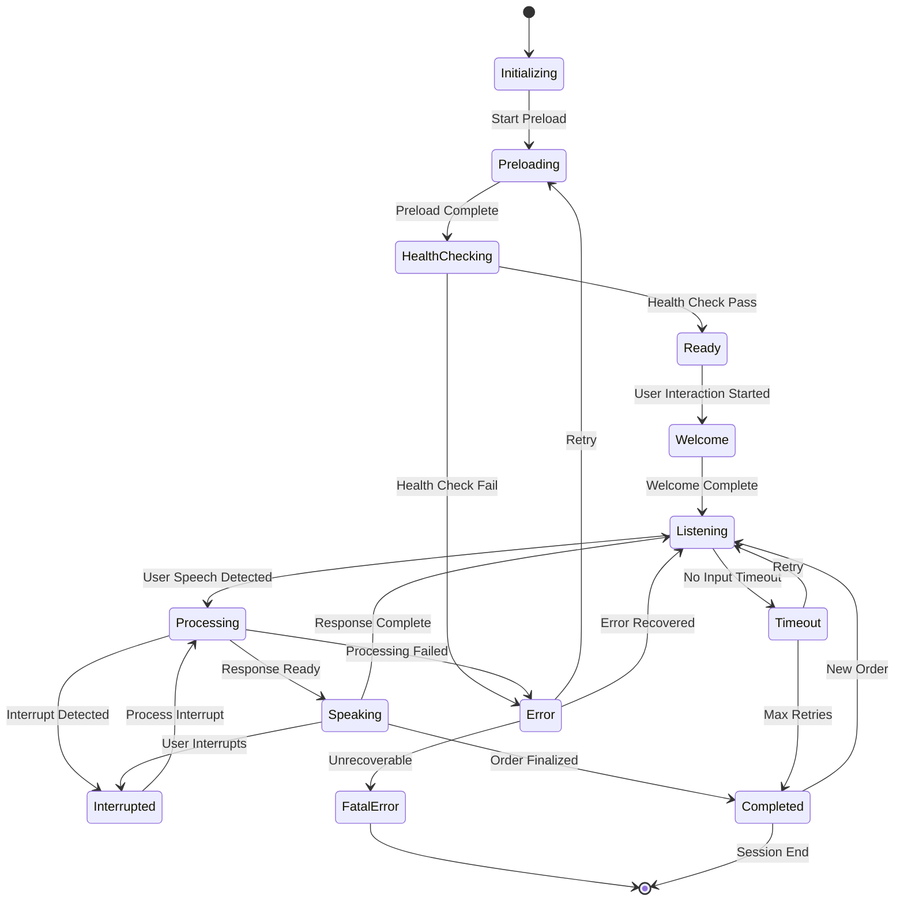

### 8.2 Order State Management

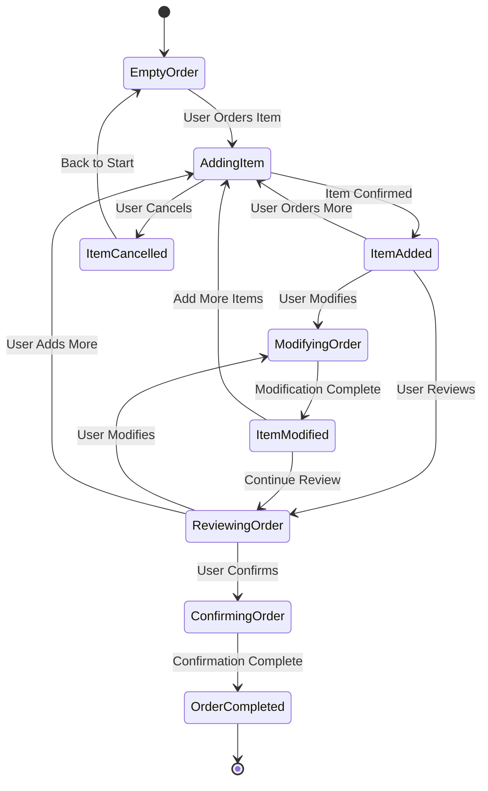

## 9. Language Detection and Switching Flow

### 9.1 Language Detection Workflow

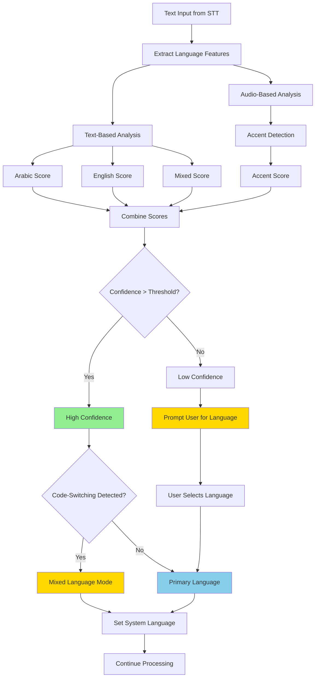

## 10. Health Check Flow

### 10.1 Comprehensive Health Check Sequence

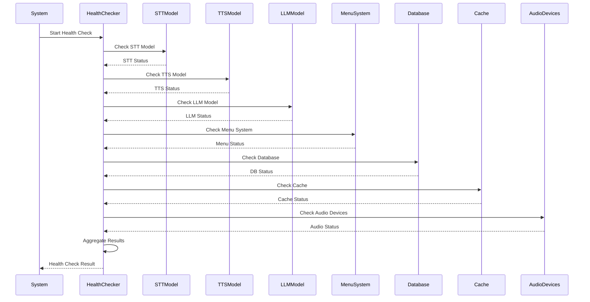

---

**Document Status**: Complete
**Diagram Format**: Mermaid (compatible with GitHub, GitLab, and most Markdown viewers)
